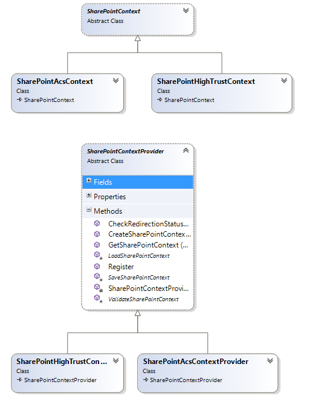

# Demo-SP-OAuth
The purpose of this project is to demonstrate maintained OAUTH context between a standard SharePoint Provider-Hosted add-in and Web API calls within the same project.

## The Issue with `SharePointContext.cs`
The `SharePointContext.cs` class, provided by Microsoft, wraps OAUTH process flow using a `TokenHelper.cs` class. The `SharePointContext` class assumes
the presence of `SPHostUrl, SPLanguage, SPClientTag, and SPProductNumber`, with the optional `SPAppWebUrl` parameters on the query string, and relies heavily on the `HttpContext.Current` object.
Further, the class relies on the server-side session to store context between browser page requests.

Web Api is *state-less* and cannot guarantee the availability of session state. Also, asynchronous Web Api calls rely on `System.Threading` namespace to create new threads, which don't allow the use of `HttpContext.Current`.
We need a reliable mechanism to maintain the SharePoint parameters between Web Api calls that don't require session state nor go out of scope because of timeout.

## The `CustomSharePointContextProvider`
The following image shows the class structure for the OOTB `SharePointContext` classes.

The `SharePointContext` class is an abstract class that is either subclassed by an ACS or High-Trust concrete class. The ACS context class handles OAUTH trust with Azure as the brokerage, whereas the High-Trust context class
uses Server-2-Server trust with certificates. Similar in structure, the provider classes are factory classes that load/create context classes.

This project follows the same model, but prefixes the class names with *Custom* labels. My classes also abstract the use of `HttpContext.Current`, and instead use an interface called `ISessionContext`.
The `ISessionContext` concrete classes provide Get and Set properties to get access to the SharePoint parameters - required to create a working OAUTH context. Two such concrete classes exist, one for regular
Http page calls (wrapping `HttpContext.Current`) and the other for Web Api (using `HttpControllerContext`). In both of the session classes, I rely on either the Query String or Cookie values to maintain the SharePoint parameters 
state between calls.

## How to use this code
I tried to make use of my custom SharePoint context code as painless as possible. Two attribute classes exist in the project:
- SPPageControllerFilterAttribute
- SPWebApiControllerFilterAttribute

Similar to the filter attribute in the stock Microsoft class, these attribute functions maintain OAUTH context for you. Simply apply the attributes to either class or methods for the Page Controller and/or Web Api controller respectively.
**Note**: The Web Api filter attribute looks for both query string and cookie values to find SharePoint parameters. If you don't pass the parameters as query string values in your JavaScript code (not required), the filter will expect to 
find values in the cookies. Cookie values are set by both filter attribute classes. If not passing query string parameters, the Web Api filter will assume the cookies were set by the Page filter attribute class in the initial page load.

## ACS verses High-Trust
ACS (low trust) uses Azure to brokerage OAUTH trust - SharePoint and your Provider-Hosted add-in both trust ACS, therefore they trust each other. Whereas High-Trust relies on shared Public/Private key exchange.
For ACS to work, SharePoint sends a *ContextToken* to your add-in, using form-value-post. Since this data is server-side and not available in JavaScript, the Page filter attribute classes looks for the context value and stores it
in a cookie, along with the other SharePoint parameters. The Web Api filter attribute class requires the context token in a cookie when using Web Api in ACS mode.

The High-Trust context relies on a `LogonUserIdentity` to create an OAUTH User+App access token (ACS uses the Context Token). To obtain the `LogonUserIdentity`, your provider-hosted add-in must require Wndows Authentication
and not use anonymous access. Both filter attribute classes enforce Windows Authentication in the attribute filter classes, save you having to update the `web.config` file.

Many thanks to [Bas Lijten](http://blog.baslijten.com/getting-sharepoint-2013-apps-and-webapi-to-work/) for his work in influencing this project.
